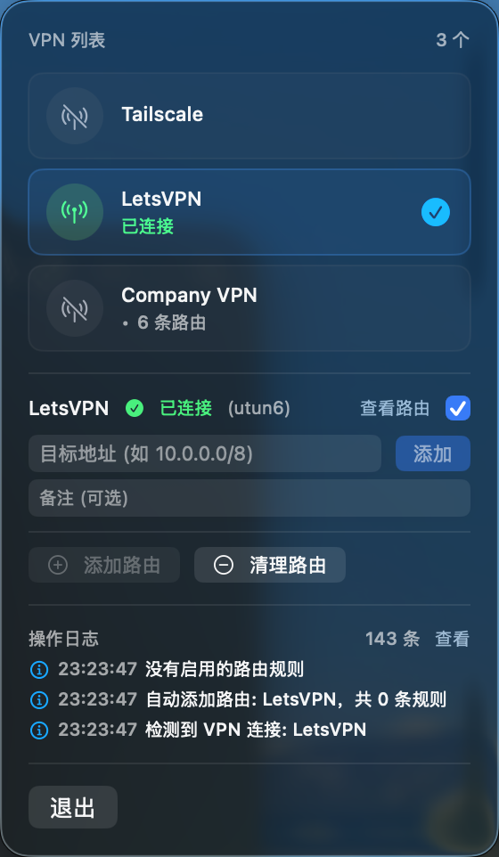

# RoutePilot

<a href="https://github.com/tdragon8113/route-pilot/releases">
  
</a>
<a href="https://github.com/tdragon8113/route-pilot/blob/main/LICENSE">
  
</a>
<a href="https://github.com/tdragon8113/route-pilot/actions">
  
</a>

macOS 菜单栏应用，自动管理 VPN 路由规则。当 VPN 连接时，自动通过 VPN 接口添加配置的路由，支持多个 VPN 同时连接。

## 功能特性

- **自动检测 VPN** - 实时监听系统 VPN 连接状态，无需手动干预
- **自动添加路由** - VPN 连接后自动应用预设的路由规则
- **多 VPN 支持** - 每个 VPN 可独立配置不同的路由规则
- **路由规则排序** - 拖拽调整规则优先级，灵活控制路由添加顺序
- **规则备注** - 为每条路由规则添加备注说明，便于管理
- **免密授权** - 可配置 sudoers 免密执行，告别重复密码输入
- **日志记录** - 分级日志系统，记录所有操作便于排查问题

## 应用截图



## 安装

### 方式一：下载 DMG（推荐）

从 [Releases](https://github.com/tdragon8113/route-pilot/releases) 页面下载最新版本的 DMG 文件，双击安装。

### 方式二：手动构建

```bash
# 克隆仓库
git clone https://github.com/tdragon8113/route-pilot.git
cd route-pilot

# 构建
xcodebuild -project RoutePilot.xcodeproj -scheme RoutePilot -configuration Release build

# 运行
open ~/Library/Developer/Xcode/DerivedData/RoutePilot-*/Build/Products/Release/RoutePilot.app
```

## 使用指南

### 基本操作

1. **启动应用** - 菜单栏显示天线图标
2. **添加 VPN** - 点击菜单栏图标，从系统 VPN 列表中选择要管理的 VPN
3. **配置路由** - 为每个 VPN 添加路由规则，如 `10.0.0.0/8`
4. **连接 VPN** - 使用系统设置或其他方式连接 VPN，应用自动添加路由

### 路由规则配置

| 目标网络 | 说明 |
|---------|------|
| `10.0.0.0/8` | 企业内网常用 |
| `192.168.0.0/16` | 私有网络 |
| `172.16.0.0/12` | Docker/K8s 网络 |
| `0.0.0.0/0` | 全流量走 VPN |

### 免密授权

路由操作需要管理员权限。可通过以下方式配置免密执行：

**应用内配置**：点击"配置免密授权"按钮

**手动配置**：
```bash
sudo echo "$(whoami) ALL=(ALL) NOPASSWD: /sbin/route" | sudo tee /etc/sudoers.d/autoroute
sudo chmod 440 /etc/sudoers.d/autoroute
```

## 文件位置

| 文件 | 路径 |
|-----|------|
| 配置文件 | `~/Library/Application Support/RoutePilot/config.json` |
| 日志文件 | `~/Library/Logs/RoutePilot/operations.log` |

## 常见问题

### Q: VPN 连接后路由没有自动添加？

检查以下几点：
1. VPN 是否出现在应用列表中
2. 是否已为该 VPN 配置路由规则
3. 查看日志文件确认是否有错误信息
4. 尝试手动点击"添加路由"

### Q: 添加路由提示权限错误？

需要管理员权限执行 `route` 命令：
- 配置免密授权（推荐）
- 或在弹窗中输入管理员密码

### Q: 支持哪些 VPN 类型？

理论上支持所有 macOS 系统 VPN：
- L2TP/IPSec（使用 `ppp0` 接口）
- Cisco IPSec（使用 `utun` 接口）
- IKEv2
- 第三方 VPN 客户端（需使用系统网络扩展）

## 技术栈

- **语言**: Swift 5.9
- **UI**: SwiftUI
- **并发**: Swift Actor 模型
- **网络监听**: SCDynamicStore + NWPathMonitor
- **最低版本**: macOS 13.0+

## 开发

### 项目结构

```
RoutePilot/
├── App/           # 应用入口、AppDelegate
├── Models/        # 数据模型（VPN、路由规则）
├── Views/         # SwiftUI 视图
├── ViewModels/    # 状态管理（AppController）
├── Services/      # 业务服务（VPN、路由、日志）
└── Utils/         # 工具类（ShellRunner）
```

### 构建命令

```bash
# Debug 构建
xcodebuild -project RoutePilot.xcodeproj -scheme RoutePilot build

# Release 构建
xcodebuild -project RoutePilot.xcodeproj -scheme RoutePilot -configuration Release build

# 清理
xcodebuild -project RoutePilot.xcodeproj -scheme RoutePilot clean
```

## 更新日志

详见 [CHANGELOG.md](CHANGELOG.md) 或 [Releases](https://github.com/tdragon8113/route-pilot/releases)。

## 许可证

[MIT License](LICENSE)